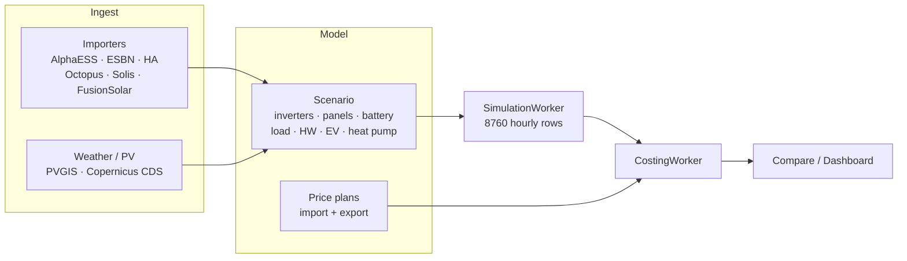
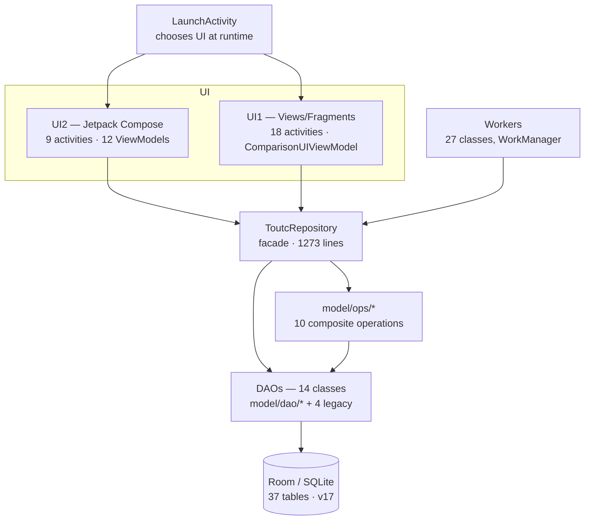
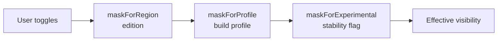

# Architecture

**Accurate as of 2026-08-09.** Anchors are repo-relative paths under
`app/src/main/java/com/tfcode/comparetout/`.

The app answers one question — *would solar, a battery or a different tariff pay
off for this household?* — by simulating a year of energy flow against imported
real consumption data, then costing that simulation against every price plan.
Everything below serves that pipeline.

## The pipeline



Two long-running background stages carry the weight, and both are idempotent and
resumable:

- **`scenario/SimulationWorker.java`** turns a scenario plus its load and
  generation data into `scenariosimulationdata` — one row per hour of a
  synthetic year 2001 calendar.
- **`CostingWorker.java`** prices that series against every active price plan
  into `costings`.

Neither recomputes what already exists. That makes staleness the central
correctness hazard — see [Invalidation](#invalidation-the-recurring-hazard).

## Layers



**`ToutcRepository`** (`model/ToutcRepository.java`) is the single entry point.
Every UI path and every worker goes through it; nothing else opens the database.
Workers instantiate it directly rather than via a ViewModel, because background
work must outlive the UI lifecycle:

```java
mToutcRepository = new ToutcRepository((Application) context);
```

**`model/ops/*`** holds composite operations too big for a DAO — the ones that
span several tables in one logical act. `ScenarioLifecycleOps` (384 lines) is the
largest: creating, copying and deleting a scenario touches the scenario row, up
to twelve component tables and their twelve junction tables, and must leave the
readiness matrix consistent.

**DAOs are mid-split.** The mega-refactor extracted ten focused DAOs into
`model/dao/`, but `ScenarioDAO` (79 methods, 30 tables) remains the big one and
the ops classes still lean on it heavily. Read `model/dao/*` as the direction of
travel, not the finished state.

| DAO | Methods | Tables | Scope |
|---|---:|---:|---|
| `model/ScenarioDAO` | 79 | 30 | Legacy catch-all; still dominant |
| `model/AlphaEssDAO` | 33 | 4 | All imported data, every source |
| `model/PricePlanDAO` | 18 | 2 | Plans and rates |
| `model/dao/SimDataDAO` | 10 | 3 | Simulation series + graph aggregation |
| `model/dao/BatteryDAO` | 10 | 7 | Battery, load shift, discharge-to-grid |
| `model/dao/PanelDAO` | 9 | 4 | Panels and panel data |
| `model/dao/ReadinessDAO` | 7 | 2 | Readiness matrix |
| `model/dao/EvDAO` | 7 | 5 | EV charge + divert |
| `model/dao/CostingDAO` (`model/`) | 7 | 1 | Costing results |
| `model/dao/LoadProfileDAO` | 7 | 4 | Load profile + data |
| `model/dao/HotWaterDAO` | 6 | 5 | HW system, schedule, divert |
| `model/dao/CombinationDAO` | 5 | 1 | Import×export plan pairings |
| `model/dao/InverterDAO` | 4 | 3 | Inverters |
| `model/dao/HeatPumpDAO` | 3 | 3 | Heat pump |

## Two user interfaces ship simultaneously

`LaunchActivity` picks between them at runtime; both are live code.

**UI2 (Jetpack Compose)** is the current surface and where new work goes — 82
files in `ui2/`, nine activities, twelve ViewModels. Screens are Composables fed
by a ViewModel that exposes state; `ui2/Source*.kt` files hold the per-source
data-management sections, extracted from what was one mega-activity.

**UI1 (Views + Fragments)** is the original surface: eighteen activities under
`scenario/`, `priceplan/` and `importers/`, all sharing a single
`ComparisonUIViewModel`. It still ships and still works. Notification taps route
to whichever UI is active via `ui2/UI2NotificationLaunch.java`.

When changing model or repository code, **check both**. A repository signature
change that compiles against UI2 can still break a UI1 fragment.

## Background work

Twenty-seven WorkManager workers. The patterns that matter:

- **Notification slots are unique per worker class** and hand-allocated (1–17).
  Reusing a slot makes two workers overwrite each other's progress. Check the
  existing `mNotificationId` constants before adding one.
- **Credentials never travel in worker `Data`.** Workers resolve them from
  `importers/CredentialStore` (encrypted DataStore, GCM). The `KEY_*` Data keys
  survive only to honour specs enqueued by older app versions.
- **Catch-up workers are periodic and guarded, not cancelled.** A disabled source
  wakes, does nothing, returns success, and resumes by itself when re-enabled —
  cancelling would leave nothing to re-enqueue it. See
  [Feature gating](#feature-gating).
- **Data-prep workers must poke the simulator.** The simulation skips scenarios
  whose panel data or weather is missing, so any worker that supplies missing
  data has to call `simulateIfNeeded` on success or the scenario stays unsimulated
  forever.

## Data sources

Every importer normalises into the **same three tables**, whatever the source:
`alphaESSRawEnergy`, `alphaESSRawPower`, `alphaESSTransformedData`. The names are
historical — AlphaESS was first — and were never refactored. All sources are read
through `AlphaEssDAO`, and each tags its rows with a prefixed system serial
(`Octopus-`, `Solis-`, `FusionSolar-`, …) so they coexist.

| Source | Package | Kind |
|---|---|---|
| AlphaESS | `importers/alphaess` | Vendor cloud API |
| Home Assistant | `importers/homeassistant` | Official websocket API; **push** is experimental |
| ESB Networks | `importers/esbn` | Published HDF file import + **experimental** scraped cloud sync |
| Octopus Energy | `importers/octopus` | Public API + tariff→plan generation |
| Solis | `importers/solis` | **Experimental** — HMAC-signed vendor API |
| FusionSolar | `importers/fusionsolar` | **Experimental** — undocumented endpoints |

`Importer.getProvidedEnergySeries()` declares which series a source supplies;
this drives filter availability in Compare. A new importer that does not declare
its series will show greyed-out filters.

## Feature gating

Three independent masks stack in `ui2/UI2VisibilitySettings.kt`, each only ever
subtracting:



- **Region** (`region/RegionProfile.kt`) — `ie` / `gb` / `source` product
  flavors set `REGION` at build time. Octopus outside GB and ESBN outside IE read
  as hidden regardless of user toggles.
- **Profile** (`profile/AppProfile.kt`) — `PROFILE` is `FULL` or `SOURCE`. The
  data-source-only edition drops Directors and the weather caches, and pins the
  Comparisons tab on so a stale toggle cannot hide a third of its UI.
- **Experimental** — one user-facing flag hiding features on unofficial or
  unproven ground. Two sources are *split* rather than hidden whole, because only
  half of each is experimental: ESBN's HDF import is a published format and stays
  (`esbnCloudEnabled` gates only the scraped sync), and Home Assistant's read
  path is an official API and stays (`haBackfillEnabled` gates only the push
  that writes into the user's recorder database).

Gating **never deletes**. Hidden data stays in the database and returns intact
when re-enabled.

## Invalidation: the recurring hazard

Simulation and costing both recompute *missing* rows only. This makes the app
fast and makes staleness the failure mode that keeps recurring:

- Saving a scenario or plan **must delete** its simulation and costing rows.
  Without that, figures stay wrong forever — nothing else will ever recompute
  them.
- `scenario_readiness` (added v13) replaced deriving those gates by scanning, and
  `SimulatorLauncher` uses `APPEND` → `KEEP` to stop a recompute storm. The
  observers around it are load-bearing, not vestigial.
- Costing decomposes: a buy total depends only on the import plan and a sell
  total only on the export side, so N import plans × M export plans costs
  **N + M** passes over the series, not N × M.

## Time

All database times are **UTC epoch-millis, stamped at ingestion**. The simulation
performs no timezone conversion — only a year/month offset onto its synthetic
2001 calendar. The user's saved zone is applied when data enters, not when it is
read. PV data must align to exact millis: PVGIS-SARAH2 stamps at :11 past the
hour and must be snapped, or the simulation silently sees zero PV.

## Testing gates

- `:app:testIeDebugUnitTest` is the CI gate (`.github/workflows/android-ci.yml`).
- Robolectric runs database, import and migration tests on the JVM.
- A golden-master harness guards simulation refactors byte-for-byte.
- `JAVA_HOME` must point at the Android Studio JBR (JDK 21) — do not pin it in
  `gradle.properties`, which breaks CI.
- Firebase Test Lab is wired but **manual**, not part of the gate.
