# Database schema

**Room / SQLite, version 17, 37 tables.** Accurate as of 2026-08-09.
Definitive source: `model/ToutcDB.java` and the entity classes it lists.

A hand-laid detailed view also exists as
[database-schema.drawio](database-schema.drawio) / `.svg`. This page is the
maintained overview; the drawio carries the fuller column-level detail.

## Shape

The schema has one dominant pattern: **a scenario owns components through
junction tables**. Twelve component types, twelve `scenario2*` junctions. The
junctions exist so a component can be *shared* between scenarios — copying a
scenario can either duplicate a battery or link the same one, and the UI offers
both.

```mermaid
erDiagram
  scenarios ||--o{ scenario2inverter : ""
  scenarios ||--o{ scenario2battery : ""
  scenarios ||--o{ scenario2panel : ""
  scenarios ||--o{ scenario2loadprofile : ""
  scenarios ||--o{ scenario2hwsystem : ""
  scenarios ||--o{ scenario2evcharge : ""
  scenarios ||--o{ scenario2heatpump : ""
  inverters ||--o{ scenario2inverter : ""
  batteries ||--o{ scenario2battery : ""
  panels ||--o{ scenario2panel : ""
  loadprofile ||--o{ scenario2loadprofile : ""
  hwsystem ||--o{ scenario2hwsystem : ""
  evcharge ||--o{ scenario2evcharge : ""
  heatpumps ||--o{ scenario2heatpump : ""
  panels ||--o{ paneldata : "generation series"
  loadprofile ||--o{ loadprofiledata : "consumption series"
  scenarios ||--o{ scenariosimulationdata : "simulation output"
  scenarios ||--|| scenario_readiness : "gates sim/costing"
  scenarios ||--o{ costings : "priced against"
  PricePlans ||--o{ costings : ""
  PricePlans ||--o{ DayRates : ""
  PricePlans ||--o{ plan_combinations : "import x export"
```

Omitted above for legibility: the remaining junctions
(`scenario2evdivert`, `scenario2hwschedule`, `scenario2hwdivert`,
`scenario2loadshift`, `scenario2discharge`) follow the identical pattern against
`evdivert`, `hwschedule`, `hwdivert`, `loadshift` and `discharge2grid`.

## Tables by role

**Core** — `scenarios`, `PricePlans`, `DayRates`, `costings`

**Scenario components** (each with a matching `scenario2*` junction) —
`inverters`, `batteries`, `panels`, `loadprofile`, `hwsystem`, `hwschedule`,
`hwdivert`, `evcharge`, `evdivert`, `heatpumps`, `loadshift`, `discharge2grid`

**Junctions** — `scenario2inverter`, `scenario2battery`, `scenario2panel`,
`scenario2loadprofile`, `scenario2hwsystem`, `scenario2hwschedule`,
`scenario2hwdivert`, `scenario2evcharge`, `scenario2evdivert`,
`scenario2heatpump`, `scenario2loadshift`, `scenario2discharge`

**Time series** — `loadprofiledata`, `paneldata`, `scenariosimulationdata`

**Imported data** — `alphaESSRawEnergy`, `alphaESSRawPower`,
`alphaESSTransformedData`, `alphaESSTransformMeta`

**Derived state** — `scenario_readiness`, `plan_combinations`

Naming is inconsistent and load-bearing: `PricePlans` and `DayRates` are
CamelCase, everything else lowercase, and the `alphaESS*` prefix applies to data
from *every* source, not just AlphaESS. Do not "tidy" these — they are the
persisted names.

## What is inverter-bound and what is not

A recurring source of confusion when adding simulation components:

- **Inverter-bound**: battery, PV panels, charge-from-grid and
  discharge-to-grid. These attach to a specific inverter.
- **Scenario-level**: load profile, hot water, EV, heat pump. These belong to the
  household, not to a device.

## Notable columns

| Column | Table | Why it matters |
|---|---|---|
| `direction` | `PricePlans` | `0` import, `1` export. Part of the unique index with supplier+name, so an import and an export plan may share a name. |
| `rateType` | `DayRates` | `0` buy, `1` sell. A plan's own rates are those matching its direction; the others are carried through untouched. |
| `dispatchMode` | `inverters` | Per-inverter dispatch strategy (v8). |
| `source`, date range | `panels` | Provenance (v11). Only historical imports drive weather-data dates; PVGIS stays anchored at 2001. |
| `systemLoss` | `panels` | Per-panel loss percentage (v12), replacing a global magic number. |
| `hwActual`, `hpActual` | imported data | Measured hot-water / heat-pump consumption (v14), used to derive rather than assume. |

## Migrations

Versions 1→16 are Room `@AutoMigration`. **16→17 is hand-written**
(`MIGRATION_16_17`) because it changes a unique index, which Room cannot derive.

Rules that have bitten before:

- A version step is **entirely** automatic or **entirely** manual. There is no
  mixing within one step.
- Room validates the post-migration schema against its generated schema
  **including index names**. Copy the DDL from the generated `17.json` rather
  than writing it by hand.
- Room cannot auto-migrate a primary-key change.
- `equals`/`hashCode` on entities are load-bearing where Room builds a
  `Map<Entity, List<Child>>` — `PricePlan` includes `direction` in both for
  exactly this reason.

Migration tests run under Robolectric on the JVM and read schemas from the
filesystem, because AGP's `includeAndroidResources` exposes main assets, not test
assets.

## Concurrency

`ToutcDB.databaseWriteExecutor` is an **8-thread pool with no ordering barrier**.
Submitting a no-op and waiting on it is *not* a barrier — a mistake made and
fixed twice. When you need a row id back, or need to read your own write, use the
synchronous path (`insertSync`) on the calling thread rather than queueing and
then looking the row up by name.
