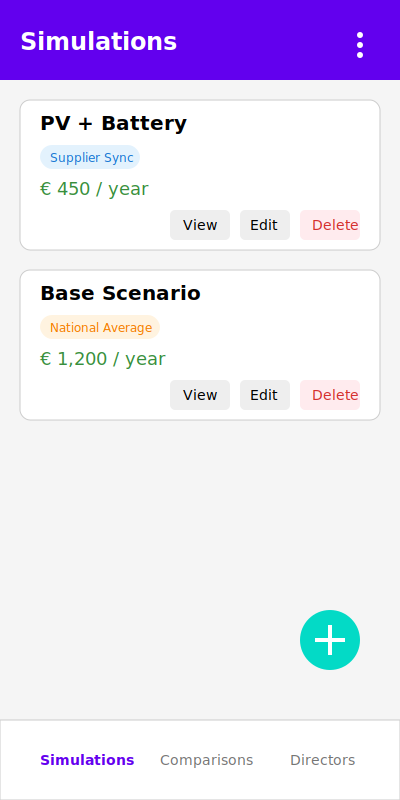
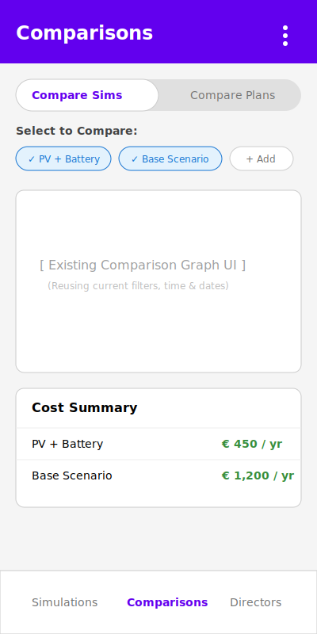
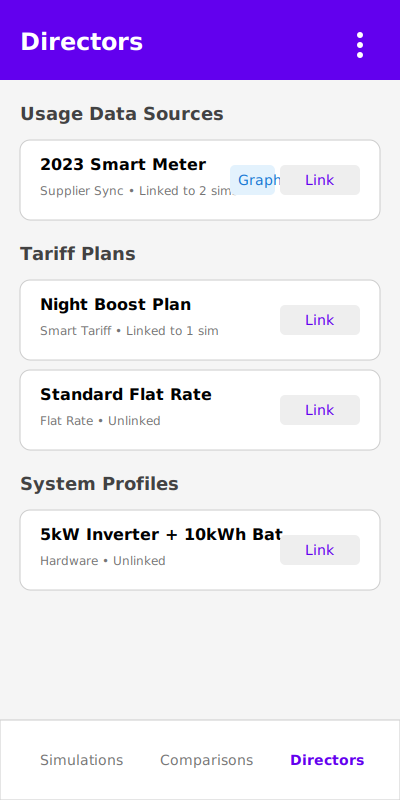

# UI2 Wireframe Mockups

These SVG mockups illustrate the general layout and structure of the three primary navigation tabs detailed in the design.

### 1. Simulations Tab
Displays the list of user scenarios (simulations) with their respective cost summaries, badges, and quick actions to view, edit, or delete.

---

### 2. Comparisons Tab
Allows side-by-side or overlaid comparison of multiple scenarios or tariff plans. Note the toggles at the top and the comparison summary table below the graph placeholder.

---

### 3. Directors Tab
Central hub for managing reusable configurations like Usage Data Sources, Tariff Plans, and System Profiles, showing linking states and quick link actions.

